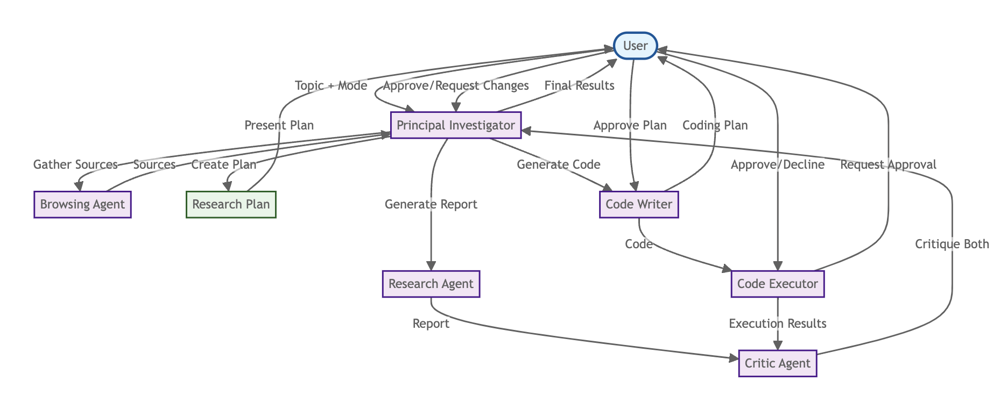

# Agentic Lab: AI Agent Driven Scientific Research Lab

Agentic Lab is a multi-agent system designed to automate scientific research where a **Principal Investigator Agent (PI Agent)** interacts with multiple specialized agents to conduct literature reviews, generate research reports, write and execute code, and iteratively refine outputs based on feedback from the user as well as a critic agent.

## **Features**
- **Automated Research**: Fetches relevant literature and drafts comprehensive reports.
- **Real Time Web Search**: Does real time web search using DuckDuckGo
- **Code Generation & Execution**: Generates Python code based on research findings, executes it, and refines it iteratively.
- **Multi-Agent Collaboration**: Includes browsing, research, coding, execution, reviewing, and critique agents.
- **Iterative Improvement**: Feedback-driven iterative refinement to enhance outputs.
- **BioMCP Integration**: Connects to biological databases and tools via BioMCP CLI for hypothesis generation.
- **Intelligent Error Handling**: LLM-driven code analysis and user feedback integration for robust error resolution.
- **Can use open weights LLMs with zero API costs**: Uses free llama 3.1:8b and other open-weights alternatives to avoid API expenses.
- **Privacy-Preserving Computation**: Runs locally or on secure environments without sending data to third-party servers.

## **New Features**

### **BioMCP Hypothesis Generator**
- **Scientific Term Extraction**: Automatically extracts genes, diseases, processes, and molecules from research topics
- **Literature Search**: Searches PubMed, clinical trials, and variant databases using BioMCP CLI
- **Hypothesis Generation**: Generates both known and novel biological hypotheses with strength analysis
- **Research Planning**: Creates detailed research plans for testing generated hypotheses
- **Interactive Refinement**: Allows user feedback to improve hypothesis quality and relevance

### **Enhanced Error Handling**
- **User Feedback Integration**: System asks for user suggestions after each failure
- **LLM-Driven Analysis**: CodeReviewerAgent uses LLM to intelligently analyze and fix code issues
- **Robust Execution**: Improved detection of execution errors and missing dependencies
- **Intelligent Package Resolution**: LLM-assisted package name resolution with user fallback

## Types of Agents

The system consists of multiple AI agents that collaborate to execute research tasks.

### **1. Principal Investigator Agent (PI Agent)**
- The main orchestrator that coordinates all the other agents.
- Ensures that research and code generation go through multiple rounds of refinement.
- Integrates feedback from **Critic Agents**.

### **2. Browsing Agent**
- Searches for reliable sources related to the research topic.
- Gathers information from PubMed, arXiv, and other credible sources.
- Can do real time web search using DuckDuckGo
- Summarizes the gathered information for downstream agents.

### **3. Research Agent**
- Drafts an initial research document based on gathered sources.
- Refines and improves the document using feedback from the **Critic Agent**.
- Ensures the research is structured, comprehensive, and scientifically accurate.

### **4. Code Writer Agent**
- Generates Python code based on the research findings.
- Ensures that code includes detailed comments explaining each step.
- Improves code iteratively based on feedback from **Code Reviewer Agent** and **Critic Agent**.

### **5. Code Executor Agent**
- Runs the generated Python code and captures execution results.
- Detects missing dependencies and installs required packages automatically.
- Handles execution errors and passes output to the **Critic Agent** for review.
- **NEW**: Asks for user suggestions after each failure for better error resolution.

### **6. Code Reviewer Agent**
- Evaluates the generated code and its execution results.
- **NEW**: Uses LLM-driven analysis to intelligently identify and fix code issues.
- Provides actionable feedback for the **Code Writer Agent**.
- **NEW**: Prioritizes user suggestions in code improvement process.

### **7. Critic Agent**
- Reviews both the research document and the generated code.
- Identifies gaps, errors, and areas for improvement.
- Summarizes feedback for the **PI Agent** to guide iterative improvements.

### **8. BioMCP Hypothesis Generator (NEW)**
- Extracts scientific terms from research topics using LLM
- Searches biological databases via BioMCP CLI
- Generates testable biological hypotheses
- Analyzes hypothesis strength and creates research plans
- Supports interactive refinement based on user feedback

Later we will add the capability for the agentic system to create custom agents on the fly instead of them being hard coded

---

## Schematic of information and instruction flows



---

## **Installation and Setup**
### **Prerequisites**
Ensure you have the following installed:
- Python 3.12+
- [Ollama](https://ollama.com/) for hosting large language models
- Conda (recommended for environment management)
- BioMCP CLI (for hypothesis generation features)

### **Project Structure**
```plaintext
agentic_lab/
│── main.py                           # Main entry point
│── agents.py                         # Defines all agent classes
│── prompts.py                        # Centralized prompts for all agents
│── config.py                         # Model configurations 
│── llm_utils.py                      # Handles interactions with the LLM
│── utils.py                          # Helper functions for saving output and logging
│── biomcp_hypothesis_generator.py    # BioMCP integration for hypothesis generation
│── biomcp_agent_simple.py            # Simple BioMCP agent implementation
│── requirements.txt                   # Python dependencies
│── environment.yml                    # Conda environment specification
│── biomcp/                           # BioMCP tool integration
│── Misc/                             # Additional agent implementations
│── Figs/                             # Documentation figures
```

### **Clone the Repository**
```bash
git clone https://github.com/tnnandi/agentic_lab.git
cd agentic_lab
```

### **Create an Ollama server, pull model from the ollama model hub, and create an inference endpoint for the LLM**
Instructions on Ollama can be found at https://github.com/ollama/ollama 
[to install ollama without sudo access: curl -L https://ollama.com/download/ollama-linux-amd64.tgz -o ollama-linux-amd64.tgz; tar -xzf ollama-linux-amd64.tgz]
```bash
ollama serve &
ollama pull <model_name> [e.g., ollama pull deepseek-r1:70b] (one time only for the initial pull) 
ollama run deepseek-r1:70b
```

### **Install Dependencies**
```bash
# Using pip
pip install -r requirements.txt

# Or using conda
conda env create -f environment.yml
conda activate agentic_lab_env
```

### **Run the code**

#### Command line arguments

| Argument         | Type     | Required | Description                                                                 |
|------------------|----------|----------|-----------------------------------------------------------------------------|
| `--topic`        | `str`    | Yes      | Specify the research topic.                                                |
| `--quick_search` | `flag`   | No       | Carry out quick search without extensive research.                         |
| `--mode`         | `str`    | No       | Choose task mode: `research_only`, `code_only`, or `both` (default: `both`)|
| `--pdfs`         | `list`   | No       | Specify one or more PDF files to include in research.                     |
| `--links`        | `list`   | No       | Specify one or more URLs to include in research.                          |
| `--files_dir`    | `str`    | No       | Path to directory containing files to analyze.                             |
| `--conda_env`    | `str`    | No       | Path to conda environment for code execution.                             |

```bash
python main.py --topic "I want to understand the genes that are responsible for low dose radiation induced changes in transcriptional states. Please write and execute code to perform quality control, filtering and tokenization (for the single cell foundation model Geneformer) for the files located in files_dir, which contain single cell data for cells exposed to different levels of radiation" --links "https://huggingface.co/ctheodoris/Geneformer/blob/main/examples/tokenizing_scRNAseq_data.ipynb" "https://huggingface.co/ctheodoris/Geneformer" "https://www.ncbi.nlm.nih.gov/geo/query/acc.cgi?acc=GSE255800" --files_dir /Users/tnandi/Downloads/GSE255800_extracted --mode code_only
```

### **BioMCP Hypothesis Generation**

For biological hypothesis generation using BioMCP:

```bash
python biomcp_hypothesis_generator.py
```

This will:
1. Extract scientific terms from your topic
2. Search literature, variants, and clinical trials
3. Generate known and novel hypotheses
4. Analyze hypothesis strength
5. Create research plans

#### Note: 
<!-- 1. Now using deepseek and Qwen reasoning models hosted on Sophia/Polaris using Ollama (Q4_K_M quantized versions). Will move to the ALCF inference endpoints when they make deepseek-r1 available. -->
- The system now includes robust error handling with user feedback integration. After each failure, the system will ask for your suggestions to improve the code or process.
- All prompts are now centralized in `prompts.py` for easier maintenance and customization.
- The BioMCP integration provides access to biological databases for hypothesis generation and validation.

---

### Scientific questions relevant to ongoing work at the lab
1. Can we prioritize genes (in-silico) for performing experimental perturbations using expensive Perturbseq?
2. Can we predict survival outcome for cancer patients using multimodal data?
3. Can we identify key genes, proteins and histology patterns related to different cancer prognosis using multimodal datasets?

---

### To do:

- [x] Add options to carry out research, or write code, or both.
- [x] Use a structured output for returning responses at each step (particularly for coding) for code execution to be successful
- [x] Adding persistent context memory (e.g., to prevent past mistakes currently the multiple rounds for improvement often do not recognize mistakes in the previous rounds)
- [x] Evaluate the framework for a wide variety of tasks relevant for biomedicine 
- [x] Allow asking intermediary questions to the user and seek their feedback (add option to turn it off)
- [x] Utilize MCP instead of API calls to connect to external tools and databases
- [ ] Create the agents dynamically; allow agents to create their own agents on the fly
- [ ] Add additional browser agents for medRxiv, bioRxiv, and google scholar
- [ ] Carry out automated scRNASeq data curation, QC, Geneformer tokenization, fine tuning and in-silico perturbation
- [x] Add capabalities to use local filesystem for research
- [x] Centralize all prompts in prompts.py for better maintainability
- [x] Implement intelligent error handling with user feedback integration
- [x] Add BioMCP integration for biological hypothesis generation
